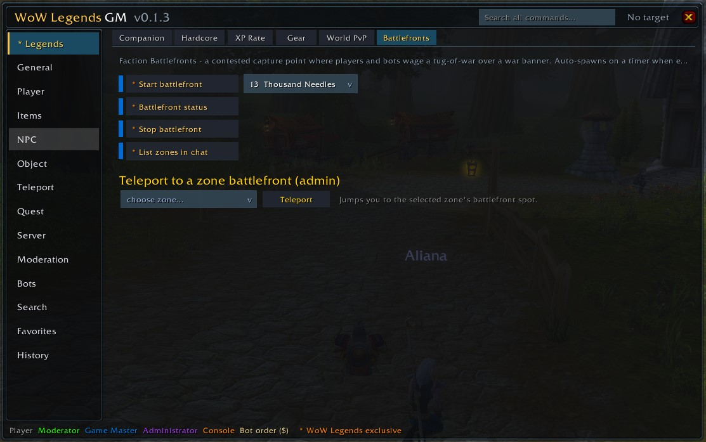
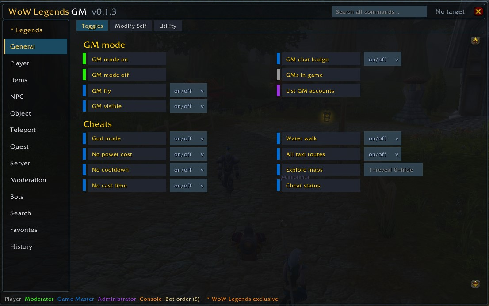

# WoW Legends — GM Addon

[](https://github.com/WOWLegendsHQ/wow-legends-gm-addon/releases/latest)
[](https://github.com/WOWLegendsHQ/wow-legends-gm-addon/releases)
[](https://wow-legends.eu)
[](LICENSE)

An in-game GM toolkit for **[WoW Legends](https://wow-legends.eu/)** (WotLK 3.3.5a / AzerothCore). Every command is one click away, with input fields and dropdowns right next to each one, plus dedicated panels for the server's WL-exclusive features and its PlayerBot army.

> **Made for the [WoW Legends](https://wow-legends.eu/) repack** — a free, self-hosted Wrath of the Lich King (3.3.5a) world with hundreds of AI-driven bots, an AI companion that chats back, hardcore mode, and a one-click installer. Get the server and client at **[wow-legends.eu](https://wow-legends.eu/)**.

### ⬇ [Download the latest release](https://github.com/WOWLegendsHQ/wow-legends-gm-addon/releases/latest/download/WoWLegends_GM.zip)

---

## Screenshots


*The ★ Legends tab — Companion, Hardcore, XP rate, Gear, World PvP and Faction Battlefronts (with a per-zone teleporter).*


*General > Toggles — GM mode and cheats, with one-click on/off dropdowns.*

---

## Highlights

- **★ Legends panel** — the WL-exclusive commands in one place: your permanent **Companion**, **Hardcore** mode + **Mak'gora** duels, **Paths of Legends**, personal **XP rate**, instant **Gear**, server-wide **World PvP** windows, and **Faction Battlefronts** with a per-zone teleporter.
- **Dungeon Clear** — one-click control of the autonomous tank-bot dungeon runner (`.dc`): start/stop, pause, skip, pull modes, per-boss routing, spectator camera — and the addon prints the tank's hidden-channel progress announcements right into your chat.
- **PlayerBot command center** — build a party (`.playerbots`), then drive your bots with one-click `$` orders (movement, combat, roles/specs, travel) via a **Party / Whisper** scope switch — plus a plain-English **Talk & Command** reference (the Guide, the Sage).
- **The whole AzerothCore command set** — General, Player, Items, NPC, Object, Teleport, Quest, Server, and Moderation, organized into clean, typed rows with dropdowns for fixed choices (race, class, on/off, …).
- **Searchable reference** — filter all **877** commands by text, access tier, and WL-only; a destination browser over all **1,989** `.teleport` locations.
- **Quality of life** — current-target readout, danger-command confirmations, favorites, command history, draggable panel + launcher, and remembered input values.

---

## Install

1. Download **[`WoWLegends_GM.zip`](https://github.com/WOWLegendsHQ/wow-legends-gm-addon/releases/latest/download/WoWLegends_GM.zip)**.
2. Extract the `WoWLegends_GM` folder into your client's AddOns directory:
   ```
   World of Warcraft\Interface\AddOns\WoWLegends_GM\
   ```
   The path `…\Interface\AddOns\WoWLegends_GM\WoWLegends_GM.toc` must exist.
3. Launch the game and enable **WoW Legends GM** on the character-select AddOns screen.
4. Log in. Click the crown button by the minimap, or type **`/wlgm`** (also `/gm`, `/gmpanel`).

> The addon only *sends* the chat lines for you — your account still needs the GM level a command requires. It never elevates permissions.

---

## Two command types

WoW Legends bots respond to **two** kinds of command, and the addon sends each one correctly:

| Type | Prefix | Sent as | Example |
|------|--------|---------|---------|
| **Dot-command** | `.` | chat line | `.worldpvp start 10`, `.companion create orc warrior Grom` |
| **Bot order** | `$` | whisper to a bot, or PARTY chat for all your bots | `$follow`, `$attack`, `$talents spec arms` |

The **Bots** tab has a scope selector — *All my bots (party)* or *Targeted bot (whisper)* — so every `$` order goes to the right place.

---

## Tabs

| Tab | What's inside |
|---|---|
| **★ Legends** | Companion · Hardcore + Mak'gora · Paths · XP rate · Gear · World PvP · Battlefronts |
| **General** | GM toggles, cheats, morph/mount, self modify (scale/speed), utilities |
| **Player** | Modify, spells, learn, reset, character ops, stats, instances/groups, guild |
| **Items** | Add items, send mail/money, bags, lookup |
| **NPC** | Spawn/manage, the `.npc set` family, lookup |
| **Object** | Gameobject add/move/turn/info, lookup |
| **Teleport** | Searchable browser of all `.teleport` destinations + the full `.go` family |
| **Quest** | Add/complete/remove/reward, lookup |
| **Server** | Announce, status, lifecycle (shutdown/restart), reloads, events, saves, Legend Roads |
| **Moderation** | Bans, mute, accounts, tickets, deserter |
| **Bots** | PlayerBot party builder, `$` orders, roles & specs, travel & guide, Talk & Command reference, regear, console tools |
| **Dungeon Clear** | Drive the autonomous tank-bot dungeon runner: start/stop/pause/skip, pull modes, go-to-boss, status/bosses, spectate — with the tank's hidden-channel announcements printed to chat |
| **Search** | Filter all 877 commands by text, tier, and WL-only |
| **Favorites** / **History** | Pinned commands, and the last commands you sent (click to re-run) |

Sections automatically use one or two columns based on their content, and scroll when long.

---

## How to use

| Action | Result |
|---|---|
| **Click** a command | Runs it with the values in the input fields |
| **Enter** in a field | Runs that row |
| **Hover** a command | Shows the exact line, its help, the required access tier, and whether it confirms |
| **Shift-click** | Drops the built command into the chat box to edit before sending |
| **Right-click** | Pin / unpin to **Favorites** |
| Header search box | Jump to the Search tab pre-filtered |
| **Shift-drag** the minimap crown | Move the launcher button |

Destructive commands (ban, kick, delete, reset, shutdown, …) ask for confirmation first. The header shows your current **target**, since many commands act on the selected unit when the name field is blank.

### Slash commands

`/wlgm` (also `/gm`, `/gmpanel`) toggles the panel. Sub-commands: `reset` (recenter panel + button), `show` / `hide`, `search <text>`, `debug` (module load status), and `probe <command>` — send a command and echo the server's response inline, e.g. `/wlgm probe .gps`.

### Access tiers

`0 Player` · `1 Moderator` · `2 Game Master` · `3 Administrator` · `4 Console` — plus `$` **bot orders**, which any player issues to their own bots. A colored pip on each row shows the tier, matching WoW item-quality colors.

---

## Compatibility

- WoW client **3.3.5a** (interface `30300`). It will not load on other clients without changing the TOC.
- Built for **AzerothCore** (the WoW Legends Playerbot branch). Commands are sent as ordinary chat; the server intercepts dot-commands before broadcasting them.
- No external libraries — only the stock 3.3.5a UI API.

## Command reference

The authoritative list of WL-custom commands, PlayerBot commands, and the `$` bot orders lives in **[GM_COMMANDS.md](GM_COMMANDS.md)**. Standard AzerothCore commands follow the [AzerothCore wiki](https://www.azerothcore.org/wiki/).

## Credits

Built for [WoW Legends](https://wow-legends.eu). Runs on [AzerothCore](https://www.azerothcore.org/) and the [mod-playerbots](https://github.com/liyunfan1223/mod-playerbots) project.

## License

[MIT](LICENSE).
